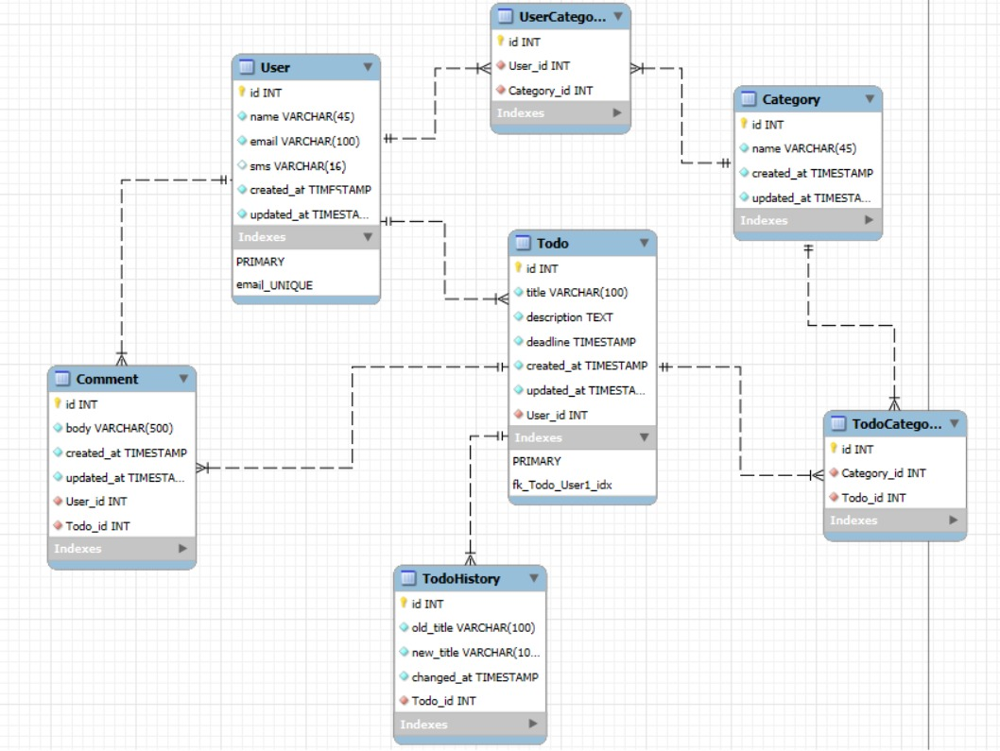

# Todo App

Este é um projeto básico de gerenciamento de tarefas (ToDo) desenvolvido com Django (Framework Python) e MySQL, utilizando Docker para facilitar a implantação e execução.

## Tecnologias Utilizadas
- Django (Framework Python)
- MySQL (Banco de dados relacional)
- Docker (Para conteinerização da aplicação)
- Docker Compose (Gerenciamento dos containers)

## Estrutura do Banco de Dados
O banco de dados foi projetado para armazenar informações sobre usuários, tarefas (todos), categorias, histórico de alterações e comentários.



- **User**: Armazena informações dos usuários.
- **Todo**: Representa uma tarefa, com título, descrição e deadline.
- **Category**: Categorias para organizar as tarefas.
- **UserCategory**: Relacionamento entre usuários e categorias.
- **TodoCategory**: Relacionamento entre tarefas e categorias.
- **Comment**: Comentários nas tarefas.
- **TodoHistory**: Histórico de alterações das tarefas.

## Como Rodar o Projeto

1. **Clone o repositório**:
   ```sh
   git clone <URL_DO_REPOSITORIO>
   cd <NOME_DO_PROJETO>
   ```

2. **Suba os containers Docker**:
   ```sh
   docker compose up -d
   ```

3. **Aplique as migrações do banco de dados**:
   ```sh
   python manage.py migrate --run-syncdb
   ```

4. **Crie um superusuário (opcional, para acessar o admin do Django)**:
   ```sh
   python manage.py createsuperuser
   ```

5. **Inicie o servidor Django**:
   ```sh
   python manage.py runserver
   ```

## Autenticação e Permissões
O projeto implementa um sistema de autenticação, permitindo que usuários autenticados criem e gerenciem suas tarefas. As permissões são configuradas para restringir o acesso a determinadas features.

## Endpoints Principais
A API segue uma estrutura RESTful. Com os seguintes endpoints:
- `POST /api/login/` - Login do usuário
- `POST /api/signup/` - Registro de novo usuário
- `POST /api/update_password/` - Atualizar senha do usuário
- `GET /api/todo/list/` - Lista todas as tarefas
- `POST /api/todo/create/` - Cria uma nova tarefa
- `PUT /api/todo/edit/{id}/` - Atualiza uma tarefa
- `DELETE /api/todo/delete/{id}/` - Deleta uma tarefa

## Melhorias Futuras
- Terminar CRUD's do projeto
- Implementação de testes automatizados
- Interface frontend para interação com a API (ainda pensando se vou fazer)

[https://github.com/NicholasAstor/todo-api-project](https://roadmap.sh/projects/todo-list-api)
